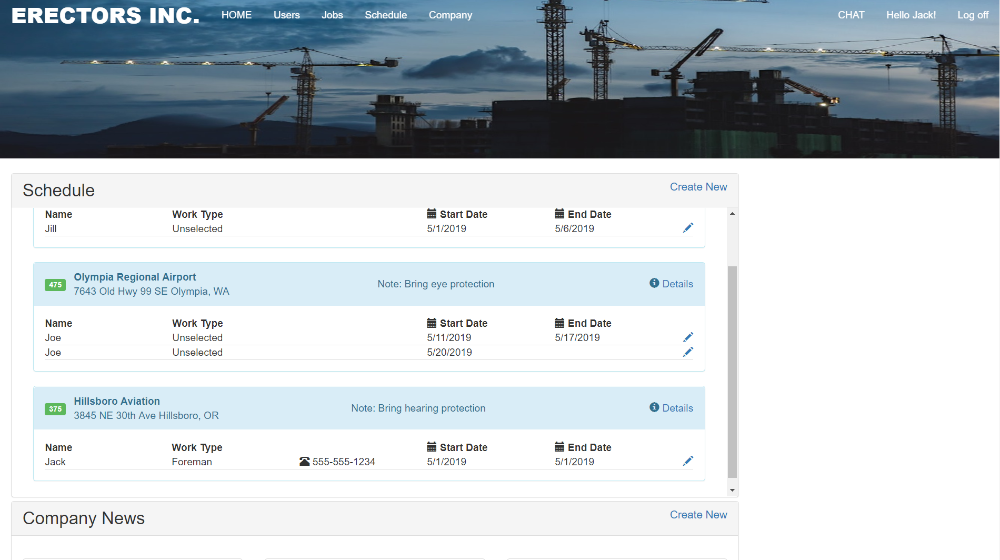

# Live Project at The Tech Academy

The Tech Academy gave me the opportunity to gain experience working with a team on a Live Project. This project is a web application for employees and managers of a local construction company. It features a dashboard that allows managers to create information about jobs, schedules, as well as for employees to look up and view that information. In addition, there is a chat feature that gives workers a central location to communicate with each other. Finally, there is a company news section.

## Summary of Technologies used


### .NET Framework MVC web application
A very mature and featureful MVC framework from Microsoft
### Entity Framework - Code First
An ORM or Object Relational Mapping framework allows one to seamlessly interface with a database such as SQL Server. Entity framework makes database CRUD operations easy and efficient.

Code First means that our database is created and updated directly in the application code. Since the data model is subject to change in the early stages of development, the database must evolve too. Instead of creating a database and then an application that must rigidly adhere to that database, the code first approach allows the database to be flexible during development.

### Razor Views - Webpages 
Razor pages allow backend code written in C# to be neatly inserted into an HTML document for rendering at runtime.

### Identity model framework
An advanced framework for authentication of users and accounts.

## Building a Model for Entity Framework
A model is simply a C# class built to represent the type of data that will be stored in the database. It also must properly represent the relationships that it has with other models.

This task requires translating an updated DB Schema from the project manager into such a model. This was an easy task, but we ran into some issues with our migration process. It was a simple solution that eluded us for a few days, but it was solved through good communication and perseverence. This taught me a valuable lesson about how even seemingly easy tasks need good teamwork to complete.

```
namespace ConstructionNew.Models
{
    public class Schedule
    {
        [Key]
        public Guid ScheduleId { get; set; }
        public virtual Job Job { get; set; }
        public virtual ApplicationUser Person { get; set; }
        [DataType(DataType.Date)]
        public DateTime StartDate { get; set; }
        [DataType(DataType.Date)]
        public DateTime? EndDate { get; set; } //EndDate Not Required, Nullable

        public Schedule()
        {

        }

        public Schedule(ApplicationUser person, Job job, DateTime startdate, DateTime? enddate)
        {
            ScheduleId = Guid.NewGuid();
            Job = job;
            Person = person;
            StartDate = startdate;
            EndDate = enddate;
        }
    }
}
```

## Creating Seed Data
Building and testing a database would be impossible with out seed data. Seed data is fictional data to be used as a placeholder for testing. This task really helped me to understand how the CREATE and UPDATE process works in Entity Framework.

```          
            var Schedules = new List<Models.Schedule>
            {
                new Models.Schedule
                {
                    ScheduleId=Guid.Parse("1283c061-9666-4b22-95fe-5c1f8cb045d1"),
                    Job=Jobs.Where(x => x.JobId == Guid.Parse("36c3d745-2db4-4e41-8a39-5cf3ecc84c32")).First(),
                    Person=applicationUsers.Where(u => u.UserName == "Jack").First(),
                    StartDate=DateTime.Parse("5/1/2019 08:00:00"),

                    EndDate=DateTime.Parse("5/1/2019 08:00:00")
                },
                new Models.Schedule
                {
                    ScheduleId=Guid.Parse("a05f2335-d7af-4b09-b636-26bf39f84829"),
                    Job=Jobs.Where(x => x.JobId == Guid.Parse("36a8eaa1-7d91-4902-90f4-215827050817")).First(),
                    Person=applicationUsers.Where(u => u.UserName == "Jill").First(),
                    StartDate=DateTime.Parse("5/1/2019 06:00:00"),
                    EndDate=DateTime.Parse("5/6/2019 16:30:00")
                },
                new Models.Schedule
                {
                    ScheduleId=Guid.Parse("32822356-24ad-4e8e-9415-c3ac5e3ca4b9"),
                    Job=Jobs.Where(x => x.JobId == Guid.Parse("e7e7a3db-62b9-4eb0-867f-3410c8d28c13")).First(),
                    Person=applicationUsers.Where(u => u.UserName == "Joe").First(),
                    StartDate=DateTime.Parse("5/11/2019 08:00:00"),
                    EndDate=DateTime.Parse("5/17/2019 16:30:00")
                },
                new Models.Schedule
                {
                    ScheduleId=Guid.Parse("94624e75-13d7-425f-bbb1-d4ea1dcfec20"),
                    Job=Jobs.Where(x => x.JobId == Guid.Parse("e7e7a3db-62b9-4eb0-867f-3410c8d28c13")).First(),
                    Person=applicationUsers.Where(u => u.UserName == "Joe").First(),
                    StartDate=DateTime.Parse("5/20/2019 08:00:00"),
                    EndDate=null
                }
            };
            Schedules.ForEach(x => context.Schedules.AddOrUpdate(s => s.ScheduleId, x));            
            context.SaveChanges();
```

## Model Binding
This was a great lesson for me in understanding a "full-stack" story where data makes a round trip from the database to the user view and back again.
Model binding is the process of translating data input from the user into the proper data type so that the ORM can work with it. In our application, the data model has complexities that the automatic code scaffolding doesn't get quite right.

### Model Binding on the Front End
A razor view that populates drop-down lists with Jobs and Workers from the database. The user selects from those lists as well as picking dates to assign to the schedule.

```
@model ConstructionNew.Models.Schedule

@{
                /**/

                ViewBag.Title = "Create";
}

<h2>Create</h2>

@using (Html.BeginForm())
{
    @Html.AntiForgeryToken()

<div class="form-horizontal">
    <h4>Schedule</h4>
    <hr />
    @Html.ValidationSummary(true, "", new { @class = "text-danger" })

    <div class="form-group">
        @Html.LabelFor(model => model.Person.UserName, htmlAttributes: new { @class = "control-label col-md-2" })
        <div class="col-md-10">
            @Html.DropDownList("Person", ViewBag.person as SelectList, "--Select Person--", new { style = "height:40px; width:450px;" })
        </div>
    </div>
    <div class="form-group">
        @Html.LabelFor(model => model.Job.JobTitle, htmlAttributes: new { @class = "control-label col-md-2" })
        <div class="col-md-10">
            @Html.DropDownList("Jobsite", ViewBag.jobsite as SelectList, "--Select Job Site--", new { style = "height:40px; width:450px;" })
            @Html.ValidationMessageFor(model => model.Job.JobTitle, "", new { @class = "text-danger" })
        </div>
    </div>

    <div class="form-group">
        @Html.LabelFor(model => model.StartDate, htmlAttributes: new { @class = "control-label col-md-2" })
        <div class="col-md-10">
            @Html.EditorFor(model => model.StartDate, new { htmlAttributes = new { @class = "form-control datepicker", type = "date" } })
            @Html.ValidationMessageFor(model => model.StartDate, "", new { @class = "text-danger" })
        </div>
    </div>

    <div class="form-group">
        @Html.LabelFor(model => model.EndDate, htmlAttributes: new { @class = "control-label col-md-2" })
        <div class="col-md-10">
            @Html.EditorFor(model => model.EndDate, new { htmlAttributes = new { @class = "form-control datepicker", type = "date" } })
            @Html.ValidationMessageFor(model => model.EndDate, "", new { @class = "text-danger" })
        </div>
    </div>

    <div class="form-group">
        <div class="col-md-offset-2 col-md-10">
            <input type="submit" value="Create" class="btn btn-default" />
        </div>
    </div>
</div>
}
```

### Model Binding on the Back-End to the View
Before the View can be populated, data must be pulled from the database and presented in a form that the view can work with. These methods get that data and create <SelectListItem> objects that are designed specifically for drop-down lists. These are pairs of data, Names and Titles that the user sees, and ID numbers so the Model binding can keep track of the data and get it back to the database.
  
 ```
         private IEnumerable<SelectListItem> GetJobSites()
        {
            // Create a list of JobTitle/JobId pairs to pass to the view with viewbag.jobsite
            // The DropDownList will display the JobTitle list and
            // The POST data receives the corresponding JobId

            IEnumerable<SelectListItem> jobsites = db.Jobs.OrderBy(o => o.JobNumber).Select(j => new SelectListItem
            {
                Value = j.JobId.ToString(),
                Text = j.JobTitle
            });

            return jobsites;
        }

        private IEnumerable<SelectListItem> GetUsers()
        {
            // Create a list of UserName/Id pairs to pass to the view with viewbag.person
            // The DropDownList will display the UserName list and
            // The POST data receives the corresponding Id

            // Eventually we might need to change this to pass FName/Id pairs as
            // usernames are probably not very relevant to the person creating the schedules.
            // They are probably going to want to see the workers actual full name.
            // Our current seed data does not contain First/Last names to do this yet.
            // Feel free to delete this comment block if we end up implementing this change,
            // or if we decide to stick with UserName for the create view.
            // -- Jeremy Stewart -- 5/5/2019

            IEnumerable<SelectListItem> users = db.Users.Where(x => x.UserName != "SiteAdmin").OrderBy(o => o.UserName).Select(u => new SelectListItem
            {
                Value = u.Id,
                Text = u.UserName
            });

            return users;
        }

        private List<Schedule> GetSchedules()
        {
            var schedules = db.Schedules.OrderBy(o => o.Job.JobNumber).ToList();
            return schedules;
        }
    }
}
```
### Model Binding View to Back-End
After the user has submitted their selections, the Controller does some validations. If all goes well, the sumbitted data is translated into an Schedule instance and sent off to the database. This requires a call to the database for the related information.

```
  public ActionResult Create(string Person, Guid JobSite, DateTime StartDate, DateTime? EndDate)
        {
            // EndDate should be after StartDate
            if (EndDate.HasValue && EndDate < StartDate)
            {
                ModelState.AddModelError("EndDate", "You must choose an End Date that is after the Start Date.");
            }
            else if (ModelState.IsValid)
            {
                // Post Method receives simple parameters from the view
                // Person and JobSite are used to fetch a Job and User from the db
                // which model binding doesn't automatically do.
                Job job = db.Jobs.Where(j => j.JobId == JobSite).First();
                ApplicationUser applicationUser = db.Users.Where(u => u.Id == Person).First();
                // Those can then be passed to the constructor along with the dates to build a schedule.
                Schedule schedule = new Schedule(applicationUser, job, StartDate, EndDate);
                db.Schedules.Add(schedule);
                db.SaveChanges();
                return RedirectToAction("Index");
            }

            // If Schedule creation failed, we need to get users and jobs to pass to the view again...
            ViewBag.jobsite = GetJobSites();
            ViewBag.person = GetUsers();
            // ... and display an error message.
            ModelState.AddModelError(string.Empty, "There was an error and your schedule was not created.");
            return View();
        }
```

### Creating a Partial View
A partial view is a view that can be displayed in on page with other partial views. This allows unrelated code to live in separate files. It also allows the same code to be reused in many places.

Here I created a partial view to display Schedules in the dashboard. This view takes advantage of User Roles to allow a Worker to view the Schedule, but only a manager is given the option to edit.




```
@using System.Web.UI.WebControls
@using ConstructionNew.Models
@using ConstructionNew.Enums
@*@model List<ConstructionNew.Models.Schedule>*@
@model List<Job>
@{ List<SelectListItem> userList =  (List<SelectListItem>) ViewData["UserList"];}

@{

    ViewBag.Title = "Schedule";
}


<div class="container">
    
    @foreach (Job job in Model)
    {
        <div class="panel panel-info">
            <div class="panel-heading">
                <table style="width:100%">
                    <tr>
                        <td style="width:40px">
                            <span class="label label-success">@job.JobNumber</span>
                            </td>
                        <td>
                            <span style="font-weight:bold">@job.JobTitle</span>
                            
                            <br />@job.StreetAddress @job.City, @job.State

                        </td>
                        <td>
                            @job.ShiftTimes
                        </td>
                        <td>
                            @*If there is a note, Display it*@
                            @if (!String.IsNullOrEmpty(job.Note))
                            {
                                <span>Note: @job.Note</span>
                            }
                        </td>
                        <td style="text-align:right">
                            <span>
                                <i class="glyphicon glyphicon-info-sign"></i>
                                @*Action Link to Job Details*@
                                @Html.ActionLink("Details", "Details", "Jobs", new { id = job.JobId }, null)
                            </span>
                        </td>
                    </tr>
                </table>
            </div>
            <div class="panel-body">
                <table style="width:100%">
                    <tr>
                        <th>Name</th>
                        <th>Work Type</th>
                        <th></th>
                        <th><i class="glyphicon glyphicon-calendar"> </i> Start Date</th>
                        <th><i class="glyphicon glyphicon-calendar"> </i> End Date</th>
                    </tr>
                    @foreach (Schedule schedule in job.Schedules)
                    {

                    <tr style="border-bottom: 1px solid #ddd">
                        <td style="width:20%">

                            @schedule.Person.UserName @*Displaying username for now, perhaps delete this line later.*@
                            @schedule.Person.FName @schedule.Person.LName @*Need to add First and Last names to seed data.*@


                        </td>
                        <td style="width:20%">
                            @schedule.Person.WorkType
                        </td>
                        <td style="width:20%">
                            @*Only Display Phone # for Foreman*@
                            @if (schedule.Person.WorkType == WorkType.Foreman)
                            {
                                <i class="glyphicon glyphicon-phone-alt"> </i> @schedule.Person.PhoneNumber
                            }
                        </td>
                        <td style="width:20%">
                            @schedule.StartDate.ToShortDateString()
                        </td>
                        <td style="width:20%">
                            @*Enddate is Nullable, check for value first*@
                            @if (schedule.EndDate.HasValue)
                            {
                                @Convert.ToDateTime(schedule.EndDate).ToShortDateString()
                            }
                        </td>

                        @*Action Link to schedule provides a quick path to EDITING for MANAGER*@
                        @if (User.IsInRole("Admin") || User.IsInRole("Manager"))
                        {
                            <td style="text-align:right">
                                <a href="@Url.Action("Edit", "Schedules", new { id = schedule.ScheduleId }, null)">
                                    <span class="glyphicon glyphicon-pencil" aria-hidden="true"></span>
                                </a>
                            </td>                   
                        }
                        @*Action Link to schedule provides a quick path to DETAILS for EMPLOYEE*@
                        @if (User.IsInRole("Employee"))
                        {
                            <td style="text-align:right">
                                <a href="@Url.Action("Details", "Schedules", new { id = schedule.ScheduleId }, null)">
                                    <span class="glyphicon glyphicon-info-sign" aria-hidden="true"></span>
                                </a>
                            </td>
                        }
                    </tr>
                    }
                </table>
            </div>

        </div>
        <br />
    }
</div>
```
